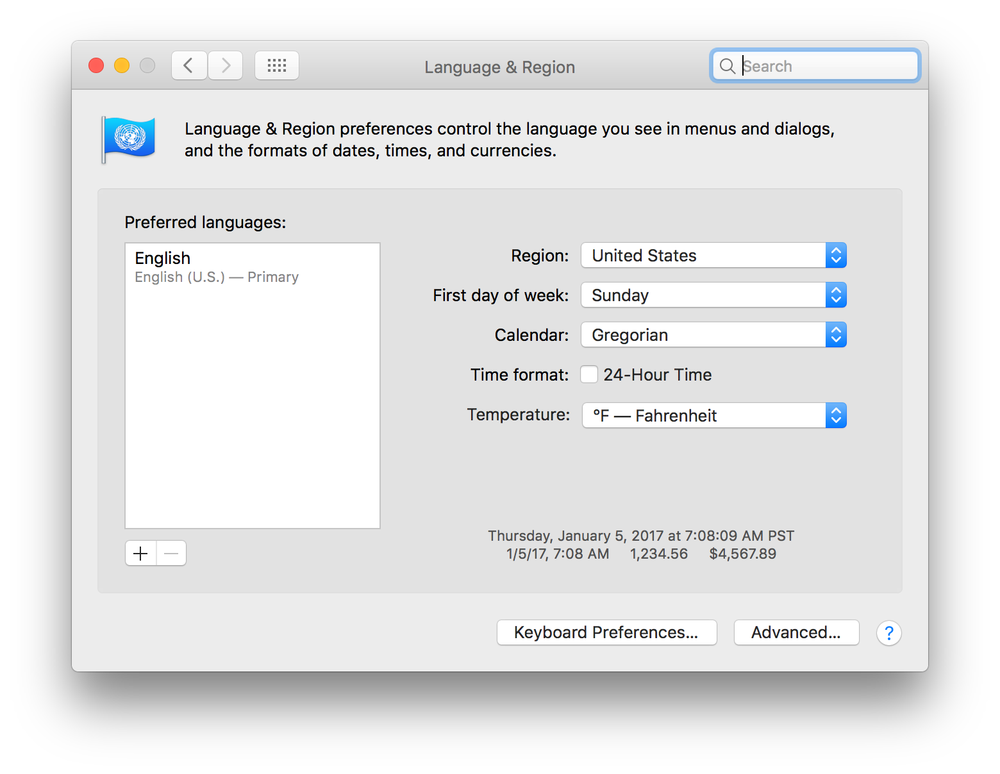
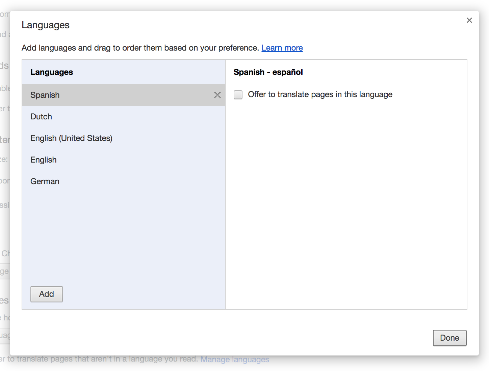
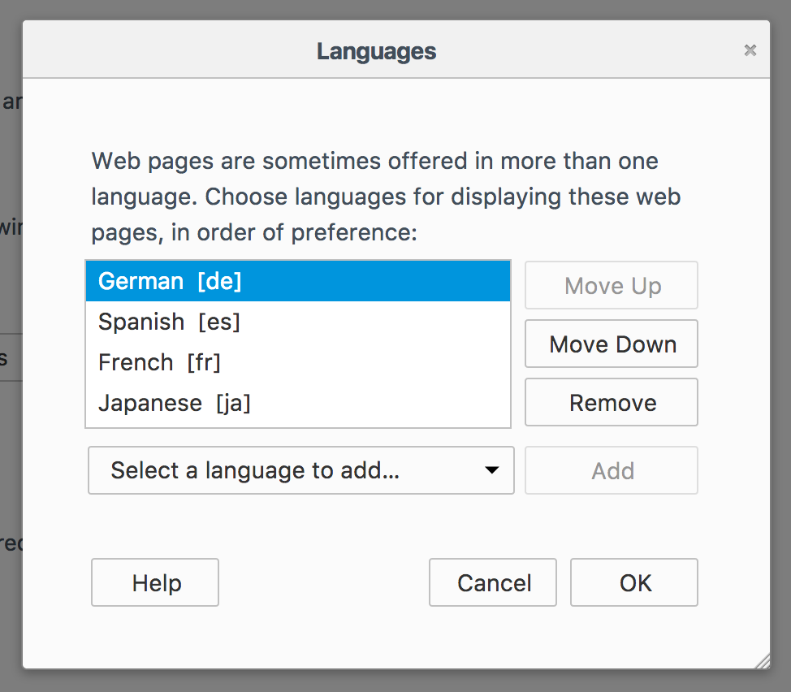
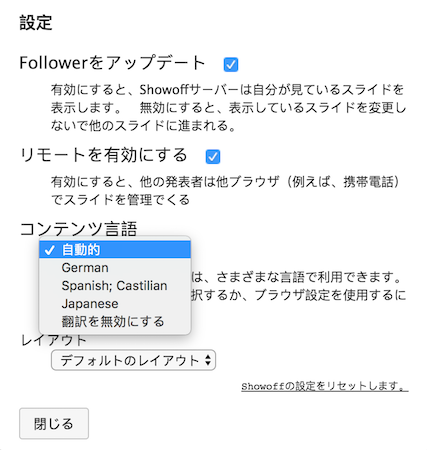

<!SLIDE >
# 国際化プレゼンテーション
## コンテンツ翻訳の組み込みサポート。

* コンテンツのローカライズ版を維持する。
* コピーを `locales/<lang code>` ディレクトリに翻訳します。
* SVG画像を自動的に翻訳します。 

.callout.thumbsup 発表者と各視聴者は、プレゼン同時に自分自身の言語。

<!SLIDE >
# 翻訳されたSVGイメージ
## スライドにインライン展開：

<svg xmlns="http://www.w3.org/2000/svg" xmlns:se="http://svg-edit.googlecode.com" xmlns:xlink="http://www.w3.org/1999/xlink" xmlns:dc="http://purl.org/dc/elements/1.1/" xmlns:cc="http://creativecommons.org/ns#" xmlns:rdf="http://www.w3.org/1999/02/22-rdf-syntax-ns#" xmlns:inkscape="http://www.inkscape.org/namespaces/inkscape" width="777" height="480" style="">                                    <title>my vector image</title>                                    <!-- Created with Vector Paint - http://www.vectorpaint.yaks.com/ https://chrome.google.com/webstore/detail/hnbpdiengicdefcjecjbnjnoifekhgdo -->                                    <rect id="backgroundrect" width="100%" height="100%" x="0" y="0" fill="#FFFFFF" stroke="none"/>                                <g class="currentLayer" style=""><title>Layer 1</title><path fill="#4a90d6" fill-opacity="1" stroke="#222222" stroke-opacity="1" stroke-width="2" stroke-dasharray="none" stroke-linejoin="round" stroke-linecap="butt" stroke-dashoffset="" fill-rule="nonzero" opacity="1" marker-start="" marker-mid="" marker-end="" d="M166,274 C166,206.5966850828729 270.7182320441989,152 400,152 C529.2817679558011,152 634,206.5966850828729 634,274 C634,341.4033149171271 529.2817679558011,396 400,396 C270.7182320441989,396 166,341.4033149171271 166,274 Z" id="manual" class=""/><foreignObject fill="#4a90d6" stroke="#222222" stroke-width="2" stroke-linejoin="round" stroke-dashoffset="" fill-rule="nonzero" font-size="50" font-family="Georgia, serif" letter-spacing="0" word-spacing="0" marker-start="" marker-mid="" marker-end="" id="svg_4" x="178.59631897327733" y="245.26605185495708" width="443.1192879066458" height="59.54128727733341" style="color: rgb(0, 0, 0); text-align: center;" class="" transform=""><text xmlns="http://www.w3.org/1999/xhtml" style="border: none;outline: none;font-size: inherit;line-height: 1em;padding:0;margin:0;">{{greeting}}</text></foreignObject></g></svg>

"{{greeting}}" という単語は、`{{greeting}}` のようなタグから生成されました。

<!SLIDE>
# 翻訳されたSVGイメージ
## または ``タグとして：

[ソースイメージ](http://localhost:9090/image//_images/translation_demo.svg)

<!SLIDE >
# 言語の設定

<!SLIDE >
# 言語の設定

<!SLIDE >
# 言語の設定

<!SLIDE >
# 言語の選択
## 自動言語選択を無効にします。

.callout.thumbsup 各視聴者は、独立して言語を選択することができる。
